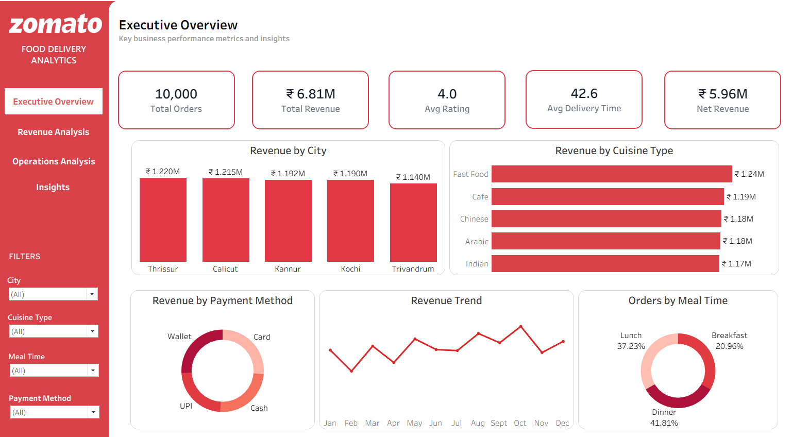
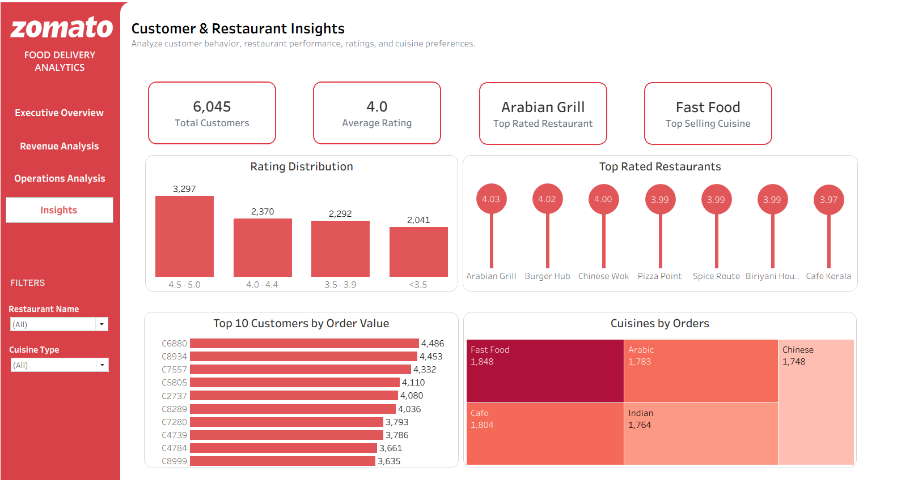

# Zomato-Food-Delivery-Analytics-Dashboard

## Overview

This **Tableau Public dashboard** analyzes Zomato food delivery performance across revenue, restaurant operations, customer behavior, delivery efficiency, cuisine preferences, and payment patterns.

The dashboard transforms food delivery data into interactive visualizations and business-focused insights to help understand **revenue performance, order trends, delivery operations, restaurant performance, and customer behavior**.

The project is designed to support data-driven decision-making by providing a consolidated view of key business performance indicators.

---

## Dashboard Pages

### 📊 Page 1 — Executive Overview

The Executive Overview provides a high-level summary of overall food delivery business performance.

**Key KPIs:**

* Total Orders: **10,000**
* Total Revenue: **₹6.81M**
* Average Rating: **4.0**
* Average Delivery Time: **42.6**
* Net Revenue: **₹5.96M**

**Dashboard includes:**

* Revenue by City
* Revenue by Cuisine Type
* Revenue by Payment Method
* Monthly Revenue Trend
* Orders by Meal Time
* Interactive filters for City, Cuisine Type, Meal Time, and Payment Method

---

### 📈 Page 2 — Revenue Analysis

The Revenue Analysis page focuses on revenue generation, discounts, restaurants, food items, and delivery categories.

**Key KPIs:**

* Total Discount: **₹850K**
* Average Order Value: **₹681**
* Total Restaurants: **7**
* Total Food Items: **54**

**Dashboard includes:**

* Discount by Cuisine Type
* Revenue by Payment Method
* Restaurants by Revenue
* Top 10 Food Items by Revenue
* Revenue by Delivery Category
* Interactive filters for Payment Method, Cuisine Type, and Delivery Category

---

### 🚚 Page 3 — Operations Analysis

The Operations Analysis page evaluates delivery efficiency, order fulfillment, and cancellation performance.

**Key KPIs:**

* Total Orders: **10,000**
* Delivered Orders: **9,192**
* Cancelled Orders: **808**
* Average Delivery Time: **42.57**

**Dashboard includes:**

* Average Delivery Time by City
* Average Delivery Time by Delivery Category
* Orders by Order Status
* Cancelled Orders by City
* Interactive filters for City, Delivery Category, and Order Status

---

### 👥 Page 4 — Customer & Restaurant Insights

This page focuses on customer behavior, restaurant ratings, cuisine preferences, and high-value customers.

**Key KPIs:**

* Total Customers: **6,045**
* Average Rating: **4.0**
* Top Rated Restaurant: **Arabian Grill**
* Top Selling Cuisine: **Fast Food**

**Dashboard includes:**

* Rating Distribution
* Top Rated Restaurants
* Top 10 Customers by Order Value
* Cuisines by Orders
* Interactive filters for Restaurant Name and Cuisine Type

---

### Dashboard Features

* Interactive multi-page dashboard navigation
* Dynamic filters and slicers
* KPI cards for quick performance monitoring
* Revenue and order trend analysis
* Restaurant and cuisine performance analysis
* Delivery efficiency analysis
* Customer behavior analysis
* Rating and restaurant performance analysis
* Payment method analysis
* Business-focused data visualization

---

## Tools & Technologies

* **Tableau Public**
* **Microsoft Excel**
* **Power Query**
* **Data Cleaning**
* **Data Preparation**
* **Data Visualization**
* **Dashboard Design**
* **KPI Development**
* **Business Analytics**

---

## Key Insights / Business Insights

* **Thrissur** generated the highest city-level revenue at approximately **₹1.22M**, followed closely by Calicut and Kannur.
* **Fast Food** was the highest-revenue cuisine type, generating approximately **₹1.24M**.
* **Dinner** accounted for the highest share of orders at **41.81%**, followed by Lunch at **37.23%**.
* The business generated approximately **₹6.81M in total revenue** and **₹5.96M in net revenue**.
* **₹850K** in total discounts were recorded, with Fast Food receiving the highest discount amount among the displayed cuisine types.
* **Burger Hub** was the highest-revenue restaurant, generating approximately **₹0.197M**.
* **Chilli Chicken** and **Kebab** were among the top food items by revenue, each generating approximately **₹0.138M**.
* **9,192 orders were delivered**, while **808 orders were cancelled**, highlighting an opportunity to reduce order cancellations.
* **Calicut** recorded the highest number of cancelled orders with **182 cancellations**.
* Average delivery time was approximately **42.57 minutes**, with delayed deliveries showing the highest average delivery time among delivery categories.
* **Arabian Grill** was the top-rated restaurant with an average rating of approximately **4.03**.
* **Fast Food** was also the leading cuisine by order volume, with **1,848 orders**.
* The rating distribution shows that the **4.5–5.0 rating range** had the highest number of ratings.
* The dashboard identifies high-value customers based on order value, supporting customer-focused business strategies.

---

## Author

### Archana

**Data Analyst | Excel | SQL | Python | Power BI**

Passionate about building interactive dashboards and transforming data into actionable insights.

🔗 **LinkedIn:** [Archana Ramesh](https://www.linkedin.com/in/archana-ramesh-)
